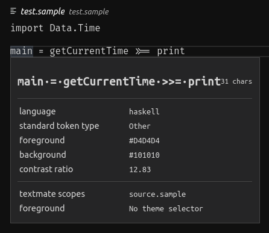

# VS Code sample extension

This extension is created to reproduce an issue
with embedded language syntax.

## Prerequisites

Install Haskell [syntax highlighter extension](https://marketplace.visualstudio.com/items?itemName=justusadam.language-haskell).

## The issue

Suppose you have written an embedded DSL in Haskell.
You have written an extension where you have defined
useful commands, snippets etc. for your language.
However writing a syntax highlighter is costly, so you'd like to
utilize existing Haskell highlighters.

The trick: define a trivial grammar with a single global scope.
In `package.json` assign Haskell to the global scope using
the `embeddedLanguages` option.

Problem: you don't get Haskell syntax highlighting for your language
although the source is correctly identified as Haskell.

On the other hand syntax highlighting works properly with a `.hs` file
in the same directory.

